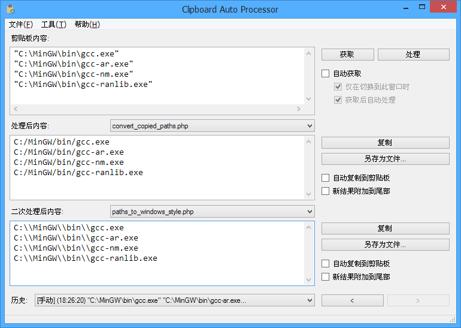
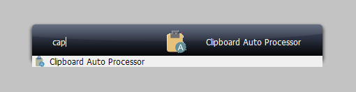
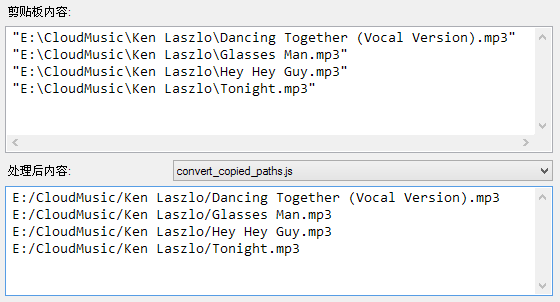
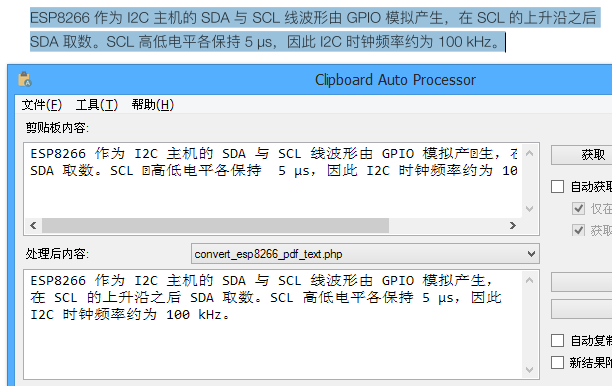
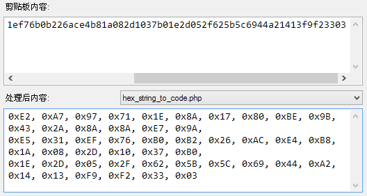
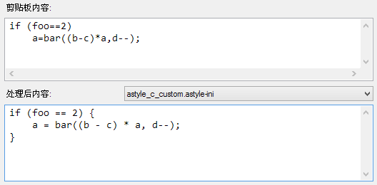

# Clipboard Auto Processor

 

## 1. 简介 ([English](#1-introduction))

Clipboard Auto Processor 是一个剪贴板文本自动处理工具。不同于一般的剪贴板增强软件只是管理历史内容，该工具可以自动调用任何脚本，来自动处理剪贴板中的内容。

脚本可以使用 PHP, Python 或 JavaScript 等任何您熟悉的语言来编写，只需实现从原始文本到所需结果的转换即可，其余工作均由 Clipboard Auto Processor 完成。

## 2. 使用方法

下载最新的 release 版本，解压到任意有写权限的位置，通常只要不放在 Windows, Program Files 或 C 盘根目录等路径下就可以。

首次运行 ClipboardAutoProcessor.exe 主程序时，程序会根据当前系统语言创建 config.ini 配置文件。之后可以修改该文件来设置脚本解释路径和显示字体等选项。

您可以手动创建快捷方式，放置到开始菜单中或桌面上。但是更推荐使用 [Launchy](https://www.launchy.net/), [Wox](http://www.wox.one/) 和 [Keypirinha](http://keypirinha.com/) 等快速启动工具，实现随时快速打开使用。

## 3. 示例脚本

* 转换文件路径列表中的反斜杠 ([js](bin/Debug/scripts/convert_copied_paths.js), [php](bin/Debug/scripts/convert_copied_paths.php), [python](bin/Debug/scripts/convert_copied_paths_base64_utf8.py))

* 调整从 PDF 文档所复制文本的格式 ([php](bin/Debug/scripts/convert_esp8266_pdf_text.php))

* 十六进制字符串到数组定义 ([php](bin/Debug/scripts/hex_string_to_code.php))

* AStyle 代码风格美化 ([ini](bin/Debug/scripts/astyle_c_custom.astyle-ini))

---

## 1. Introduction

Clipboard Auto Processor is a utility to process the text in clipboard automatically. Unlike other clipboard enhancement softwares which could only manage the history contents, this tool can execute any script to process the content automatically.

The script can be written in any language that you are familiar with, such as PHP, Python or JavaScript. It only needs to implement the conversion from original text to desired result. Other works will be all done by Clipboard Auto Processor.

## 2. Usage

Download the latest release version, and extract it to any location that have write permission. Generally any folder except Windows, Program Files and C drive root is OK.

When the ClipboardAutoProcessor.exe is running for the first time, it will create the config.ini file based on the current system language. And then you can edit this file to set script interpreter, display font and other options.

You can manually create the shortcut, and put it into start menu or on desktop. But it is more recommended to use a launcher, such as [Launchy](https://www.launchy.net/), [Wox](http://www.wox.one/) and [Keypirinha](http://keypirinha.com/), to quickly open and use at any time.

## 3. Sample scripts

* Convert the backslashes in copied path list ([js](bin/Debug/scripts/convert_copied_paths.js), [php](bin/Debug/scripts/convert_copied_paths.php), [python](bin/Debug/scripts/convert_copied_paths_base64_utf8.py))

* Adjust the text format copied from PDF document ([php](bin/Debug/scripts/convert_esp8266_pdf_text.php))

* Generate array define code from hex string ([php](bin/Debug/scripts/hex_string_to_code.php))

* AStyle coding style beautifier ([ini](bin/Debug/scripts/astyle_c_custom.astyle-ini))

